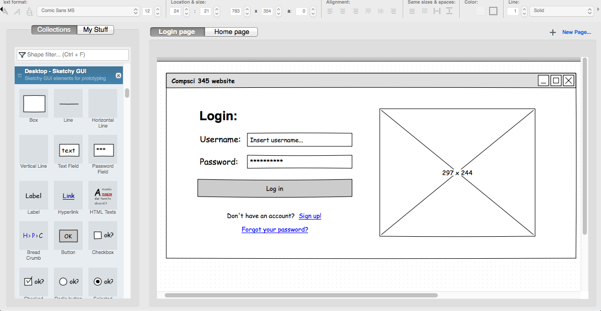

# Wireframes

* 🔖 **Use Case**
* 🔖 **Wireframes**
* 🔖 **Navigation**

___

## 📑 Use Case

Comme étudié en UML, les cas d'utilisation décrivent la demande. Avant de rédiger les vues filaires vous devez créer un diagramme de cas d'utilisation pour chaque histoire utilisateur et les lier avec votre diagramme de contrainte.

___

👨🏻‍💻 Manipulation

Créez un diagramme de cas d'utilisation pour chaque histoire utilisateur de façon individuelle.

> Exportez les en **fragment** et importez les pour les mettre en relation avec le diagramme de contrainte pour chaque fonctionnalité.

___

## 📑 Wireframes

Plus parlant qu'un diagramme et plus en rapport avec une expérience utilisateur, la vue filaire correspond à la description visuelle d'un écran d'affichage et ses éléments d'intéraction.

L'objectif d'une wireframe n'est pas d'exposer la charte graphique, les images de fonds et l'identité visuelle de la frame.

Il existe de nombreux outils gratuit, en client lour ou leger. Je vous conseille pour sa gratuité et sa simplicité le logiciel Pencil: https://pencil.evolus.vn/

___

👨🏻‍💻 Manipulation

Après avoir assisté à une overview du logiciel, pour chaque histoire utilisateur, représentez la vue filaire et ses déclinaisons de façon individuelle puis exportez les au format image.

___

## 📑 Navigation

Les frames doivent être mises en relation pour comprendre la navigation.

Sur un logiciel de wireframes il est possible de mettre les pages en relation en utilisant les éléments graphiques mis à disposition et en les reliant une fois rassemblés sur une nouvelle page.

___

👨🏻‍💻 Manipulation

Réunisez les wireframes sur une page et mettez les en relation de façon collégiale.

___

### 🏷️ **Flow Chart**

Pour normer la mise en relation des frames et posséder une overview reliée aux wireframes il est résonnable de conclure par un diagramme de navigation.

Il n'existe pas de diagrammes de navigation en UML, nous allons utiliser le flow chart diagram pour cette représentation.

___

👨🏻‍💻 Manipulation

Créez votre flow chart diagram de façon collégiale, reliez le à votre diagramme de contraintes et reliez chaque wireframe avec l'outil link au flow chart diagram.

___

